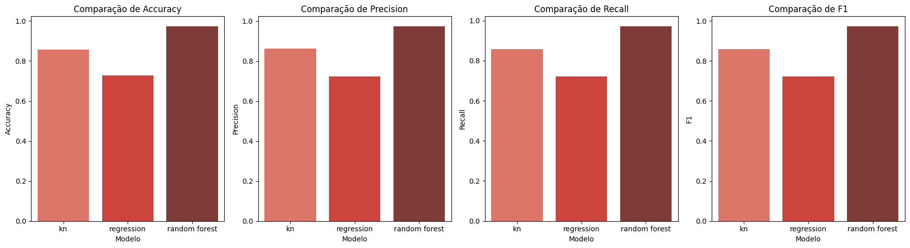
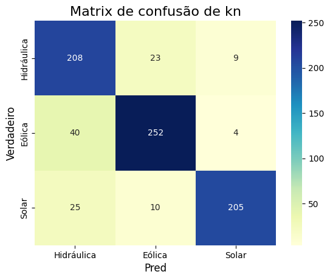
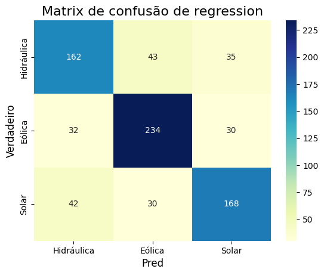
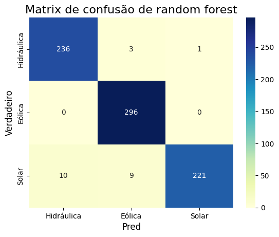

# Avaliação — APIs, energias renováveis e aprendizado de máquina
## Nomes / rms
- Gabriel de Paula Santos - Rm : 573195
- Joao Lucas Silva Lopes - Rm : 573875
- Enzo Ribeiro - Rm : 569429
- Alan Otalvaro - Rm : 571794
- joao Pedro ribeiro santos - Rm : 570562
- Joao Pedro Evangelista - Rm : 573899

## Proposta

Use o notebook de apoio para consultar **duas APIs públicas** e gerar os arquivos `aneel_classificacao_orange.csv` e `meteo_regressao_orange.csv`. Em seguida, desenvolva **duas tarefas independentes em Python**: uma de classificação e outra de regressão. **Treine e compare três algoritmos diferentes em cada tarefa.** O notebook fornece apenas a conexão às APIs e a preparação dos CSVs: bibliotecas, modelos, análises e resultados de ML devem ser acrescentados por você.

As consultas públicas escolhidas **não exigem token**. Caso um serviço passe a exigir credenciais, nunca as publique no GitHub.

## Tarefa 1 — Classificação da fonte renovável

**Fonte:** [SIGA — ANEEL](https://dadosabertos.aneel.gov.br/dataset/siga-sistema-de-informacoes-de-geracao-da-aneel). Cada linha do CSV representa um empreendimento de geração no Brasil. A coluna `fonte` reúne **Solar** (`UFV`), **Eólica** (`EOL`) e **Hidráulica** (`UHE`, `PCH`, `CGH`). O cadastro inclui empreendimentos em diferentes fases; os dados não medem energia gerada.

| Atributo no CSV | Origem na API | Descrição | Papel |
|---|---|---|---|
| `potencia_kw` | `MdaPotenciaOutorgadaKw` | Potência outorgada em quilowatts; não representa energia produzida | Entrada |
| `latitude` | `NumCoordNEmpreendimento` | Latitude aproximada, em graus decimais | Entrada |
| `longitude` | `NumCoordEEmpreendimento` | Longitude aproximada, em graus decimais | Entrada |
| `fonte` | `SigTipoGeracao` | Categoria da fonte, agrupada em três classes | Alvo |

**Seu trabalho:** explore a quantidade de linhas, valores ausentes, distribuição das classes e características das entradas. Defina `X` e `y`; separe treino/teste de forma **estratificada** (sugestão: 80%/20%) e fixe a semente. Treine **três classificadores distintos** nas mesmas divisões e compare **Accuracy, Precision, Recall, F1** e **matriz de confusão**. Informe se usou média `macro`, `weighted` ou outra para métricas multiclasses. Interprete as classes mais confundidas e as limitações de prever a fonte apenas por potência e localização. Faça padronização dentro do treino quando o algoritmo exigir; não use como entrada nome, código CEG, sigla ou descrição que entregue a resposta.

## Tarefa 2 — Regressão da radiação solar

**Fonte:** [API histórica Open-Meteo](https://open-meteo.com/en/docs/historical-weather-api). Dados horários estimados para **Petrolina (PE)**, coordenadas aproximadas **−9,39, −40,50**, de **01/04/2025 a 30/06/2025**, no fuso `America/Recife`. Cada linha do CSV é uma hora local entre **7h e 17h**. Os valores históricos são derivados de modelos/reanálise, não de um painel fotovoltaico.

| Atributo no CSV | Origem na API | Descrição | Papel |
|---|---|---|---|
| `data_hora` | `time` | Data e hora local; use para ordenar e separar por tempo | Identificação, não entrada |
| `temperatura_c` | `temperature_2m` | Temperatura do ar a 2 m, em °C | Entrada |
| `umidade_pct` | `relative_humidity_2m` | Umidade relativa a 2 m, em % | Entrada |
| `nuvens_pct` | `cloud_cover` | Cobertura total de nuvens, em % | Entrada |
| `vento_kmh` | `wind_speed_10m` | Velocidade do vento a 10 m, em km/h | Entrada |
| `hora` | Derivada de `time` | Hora local do registro, de 7 a 17 | Entrada |
| `radiacao_w_m2` | `shortwave_radiation` | Radiação solar global horizontal média da hora anterior, em W/m² | Alvo |

**Seu trabalho:** explore as variáveis e os dados ausentes; apresente ao menos uma visualização e defina `X` e `y`. Use as **primeiras 80% das horas para treino** e as últimas 20% para teste, preservando a ordem temporal. Treine **três regressores diferentes** usando a mesma divisão. Compare **MAE** (W/m²), **MSE** ((W/m²)²) e **R²**; faça um gráfico de valores reais × previstos. Explique o papel da hora do dia e por que estimar radiação **não equivale a prever a geração elétrica**. Não inclua `radiacao_w_m2` ou uma transformação direta dela em `X`.

## Entrega

## 1. Sobre o projeto

O projeto utiliza dados de duas APIs públicas para desenvolver duas aplicações de Machine Learning:

- **Classificação:** identificar a fonte de energia de empreendimentos da ANEEL.
- **Regressão:** estimar a radiação solar em Petrolina (PE).

Em cada tarefa foram utilizados três modelos diferentes para comparação.

---

## 2. Tecnologias

- Python
- Pandas
- NumPy
- Matplotlib
- Seaborn
- Scikit-learn
- API SIGA — ANEEL
- API Histórica — Open-Meteo
- Google Colab / Jupyter Notebook

---

# 3. Classificação — Fonte de Energia

### Fonte dos dados

Os dados foram obtidos pela API pública da **ANEEL — SIGA**.

Foram utilizadas três classes:

- `Solar` → UFV
- `Eólica` → EOL
- `Hidráulica` → UHE, PCH e CGH

### Variáveis utilizadas

| Variável | Função |
|---|---|
| `potencia_kw` | Entrada |
| `latitude` | Entrada |
| `longitude` | Entrada |
| `fonte` | Alvo |

Foram obtidos **3.876 registros** válidos.

### Modelos utilizados

- KNN
- Regressão Logística
- Random Forest Classifier

A divisão utilizada foi de 80% para treinamento e 20% para teste, com estratificação das classes.

### Resultados

| Modelo | Accuracy | Precision | Recall | F1 |
|---|---:|---:|---:|---:|
| KNN | 85,70% | 86,22% | 85,74% | 85,79% |
| Regressão Logística | 72,68% | 72,32% | 72,18% | 72,24% |
| Random Forest | **97,16%** | **97,38%** | **96,94%** | **97,11%** |

### Comparação dos modelos



**Insight:** o Random Forest apresentou o melhor desempenho em todas as métricas, ficando aproximadamente 24 pontos percentuais acima da Regressão Logística em Accuracy.

### Matrizes de confusão

#### KNN



**Insight:** o KNN apresentou maior dificuldade para diferenciar empreendimentos eólicos de hidráulicos.

#### Regressão Logística



**Insight:** a Regressão Logística apresentou mais erros distribuídos entre as três classes, resultando no menor desempenho geral.

#### Random Forest



**Insight:** o Random Forest apresentou poucas classificações incorretas. A classe Eólica foi identificada corretamente em todos os registros do conjunto de teste.

### Conclusão da classificação

O **Random Forest Classifier** foi o modelo mais adequado para essa tarefa. Os resultados indicam que potência e localização possuem informações suficientes para diferenciar as fontes de energia com boa precisão neste conjunto de dados.

---

# 4. Regressão — Radiação Solar

### Fonte dos dados

Os dados meteorológicos foram obtidos pela **API Histórica Open-Meteo**.

Local analisado:

- Petrolina — PE
- Latitude: `-9,39`
- Longitude: `-40,50`
- Período: 01/04/2025 a 30/06/2025
- Horário analisado: 07h às 17h

### Variáveis utilizadas

| Variável | Função |
|---|---|
| `temperatura_c` | Entrada |
| `umidade_pct` | Entrada |
| `nuvens_pct` | Entrada |
| `vento_kmh` | Entrada |
| `hora` | Entrada |
| `radiacao_w_m2` | Alvo |

### Modelos utilizados

- Regressão Linear
- Random Forest Regressor
- Decision Tree Regressor

A comparação foi realizada utilizando:

- MAE
- MSE
- R²

### Gráfico de valores reais × previstos

O notebook gera um gráfico comparando os valores reais de radiação com os valores previstos pelo **Random Forest Regressor**.


**Insight:** quanto mais próximos os pontos estiverem da linha ideal, mais próximas estarão as previsões dos valores reais. Os desvios em relação à linha representam os erros do modelo.

> **Observação:** o gráfico acima é gerado pelo código da aplicação, porém não estava salvo como saída no notebook enviado. Ele deve ser adicionado à pasta `figuras/` após executar a célula de regressão.

### Importância da variável `hora`

A hora do dia é uma variável importante porque a radiação solar varia conforme a posição do Sol. Por isso, ela ajuda o modelo a diferenciar períodos de menor e maior incidência solar.

### Conclusão da regressão

A regressão busca estimar a **radiação solar em W/m²** a partir das condições meteorológicas e da hora. Essa estimativa não representa diretamente a energia produzida por um painel fotovoltaico, pois a geração também depende de fatores como equipamento, área, eficiência e orientação do sistema.

---

# 5. Fluxo do projeto

```text
APIs públicas
     ↓
Coleta dos dados
     ↓
Tratamento e organização
     ↓
Criação dos CSVs
     ↓
Treinamento dos modelos
     ↓
Comparação das métricas
     ↓
Gráficos e análise
     ↓
Conclusões
6. Arquivos gerados
aneel_classificacao_orange.csv
meteo_regressao_orange.csv
Aula_APIs_Energia_Renovavel_ML_(resolvido).ipynb
figuras/
7. Conclusão geral

O projeto demonstrou a aplicação de Machine Learning em dois problemas relacionados às energias renováveis.

Na classificação, o Random Forest apresentou o melhor resultado, alcançando 97,16% de Accuracy.

Na regressão, foram comparados três modelos para estimar a radiação solar a partir de variáveis meteorológicas e da hora do dia.

Dessa forma, o projeto percorreu todo o processo de coleta de dados, preparação, treinamento, avaliação e interpretação dos resultados.

# Figuras do projeto

Gráficos gerados pela aplicação de classificação da fonte de energia.

- `comparacao_metricas_classificacao.png` — comparação de Accuracy, Precision, Recall e F1.
- `matriz_confusao_knn.png` — matriz de confusão do KNN.
- `matriz_confusao_regressao_logistica.png` — matriz de confusão da Regressão Logística.
- `matriz_confusao_random_forest.png` — matriz de confusão do Random Forest.


## Entrega

Envie **somente o link para um repositório público no GitHub**. Ele deve conter:

1. Um `README.md` com objetivo, origem e período dos dados, instruções de execução e conclusões das duas tarefas.
2. O notebook `.ipynb` completo, executável na ordem, com seus imports, análise, treinamento e comparação dos **seis modelos** (três por tarefa), métricas, gráficos e interpretação em texto.
3. Os dois arquivos CSV gerados, ou instruções completas e verificadas para reproduzi-los a partir das APIs.

Não publique senhas ou tokens. As tabelas de resultados devem identificar claramente os três algoritmos de cada tarefa e a mesma configuração de avaliação usada na comparação.
